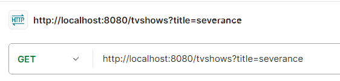
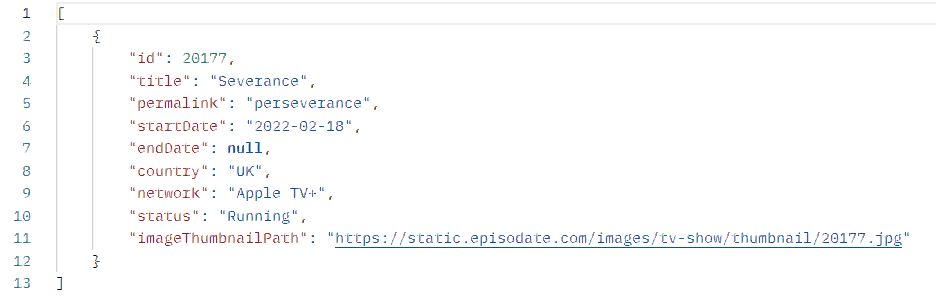

# TV Show API Application

REST API for searching information about TV Shows.

## Content
- [Functional](#functional)
- [Technologies](#technologies)
- [Installation](#installation)
- [Usage](#usage)
- [Example](#example)
## Functional
- Searching TV Shows by title
- Returning results in JSON format

Note: Application can return list of TV Shows with entered title. Also you can provide incomplete title.

## Technologies:
- Java
- Spring Boot
- Lombok
- Maven

## Installation

Clone the repository:

```bash
    git clone https://github.com/1kotik/tvshow-api
```

## Usage
### Type Request
In command line:
```
curl -X GET "http://localhost:8080/tvshows?title={your-title}"
```

In browser (or platforms for using APIs (Postman)):
```
http://localhost:8080/tvshows?title={your-title}
```

## Example
### Type Request in Postman:



### Get JSON:




